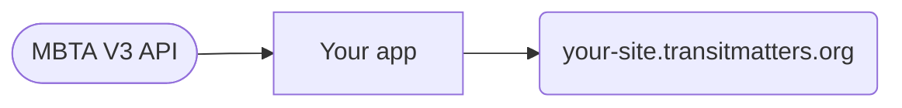

# TransitMatters Labs Docs

Onboarding docs and architecture diagrams for TransitMatters Labs volunteers.

**Read them at https://transitmatters.github.io/architecture/**

## Editing

Pages are Markdown in [`docs/`](docs/). Diagrams are [Mermaid](https://mermaid.js.org/) code blocks inside those pages, so they render on GitHub too:

````markdown

````

Shape conventions are on the [architecture overview](docs/architecture/index.md#reading-the-diagrams). The [Mermaid Live Editor](https://mermaid.live/) is handy for trying out changes.

## Running locally

Requires [uv](https://docs.astral.sh/uv/).

```bash
uv sync
uv run mkdocs serve
```

Then open http://127.0.0.1:8000.

## Deploying

Merging to `main` publishes the site to GitHub Pages via [`.github/workflows/docs.yml`](.github/workflows/docs.yml). PRs run a strict build, so broken links fail CI.
