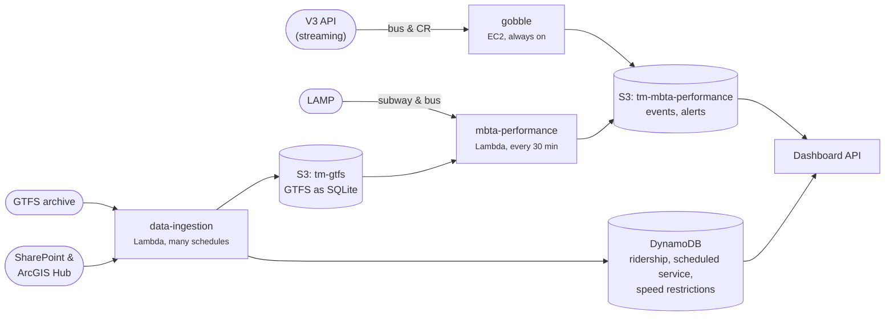
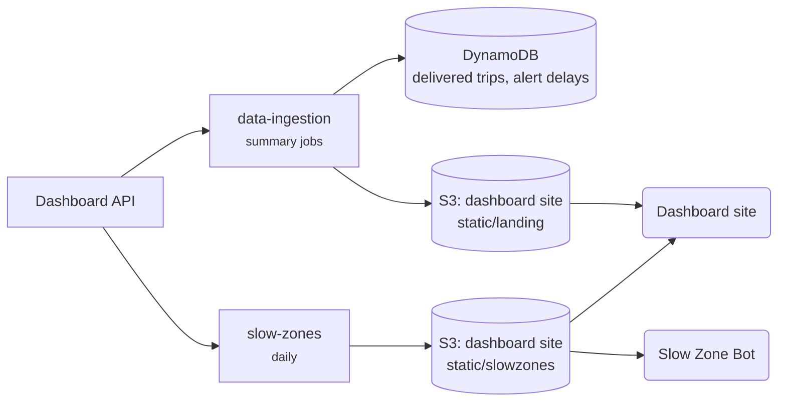

# Data pipeline

How raw MBTA data becomes the charts on the [Data Dashboard](https://dashboard.transitmatters.org).

It happens in two steps.

## 1. Raw data in

Jobs copy MBTA data into our own storage. The API serves it from there.

## 2. Summaries

Some jobs read the API back, compute summaries, and store them. DynamoDB summaries are served by the API; JSON files are fetched straight from the site.

## What we store

We use **S3** for files: cheap, fast, and good for large archives. We use **DynamoDB** for pre-aggregated time series, where the API needs a small slice without downloading a whole file.

| Data | Comes from | Stored in | Written by | Read by |
|---|---|---|---|---|
| Arrival/departure events | LAMP, V3 stream, monthly files | `tm-mbta-performance` `Events-lamp/`, `Events-live/`, `Events/` | mbta-performance, gobble | Dashboard API |
| GTFS snapshots | GTFS archive | `tm-gtfs` (one SQLite DB per feed) | data-ingestion | mbta-performance, data-ingestion |
| Scheduled service | GTFS | `ScheduledServiceDaily` | data-ingestion | API |
| Delivered trips | Dashboard API | `DeliveredTripMetrics` (+ `Extended`, `Weekly`, `Monthly`) | data-ingestion | API, landing page |
| Ridership | SharePoint, ArcGIS Hub | `Ridership` | data-ingestion | API |
| Alerts | V3 API, LAMP | `tm-mbta-performance` `Alerts/` | data-ingestion, mbta-performance | API |
| Alert delays | Dashboard API | `AlertDelaysDaily`, `AlertDelaysWeekly` | data-ingestion | API |
| Speed restrictions | ArcGIS Hub | `SpeedRestrictions` | data-ingestion | API (slow zone map) |
| Prediction accuracy | ArcGIS Hub | `TimePredictions` | data-ingestion | API |
| Slow zones | Dashboard API | `dashboard.transitmatters.org` `static/slowzones/` | slow-zones | Dashboard site, Slow Zone Bot |
| Landing page stats | DynamoDB | `dashboard.transitmatters.org` `static/landing/` | data-ingestion | Dashboard site |
| Travel time benchmarks | slow-zones archive | `tm-mbta-performance` `Benchmarks-tm/` | mbta-performance | API |
| Service & ridership summary | GTFS, ridership | `tm-service-ridership-dashboard` | data-ingestion | API |
| Bluebikes, weather | GBFS, Open-Meteo | `tm-bluebikes`, `tm-mbta-performance` `Weather/` | data-ingestion | Archive only, for now |

Names in `code` without a bucket are DynamoDB tables.

## Things that trip people up

- **Two event sources.** Subway events come from LAMP (`Events-lamp/`). Bus and Commuter Rail come from gobble (`Events-live/`).
- **Historical data is loaded by hand.** Monthly archives in `Events/` are uploaded with a [runbook](https://github.com/transitmatters/mbta-performance/blob/main/mbta-performance/chalicelib/historic/README.md), not on a schedule.
- **Static JSON lives in the site bucket.** Slow zones and landing page stats are written straight into the dashboard's frontend bucket, then CloudFront's cache is cleared.
- **Times are UTC.** Lambda schedules are in UTC, and most skip roughly 3–6 AM Boston time, when the T isn't running.

## Key code

- Events from S3: [`t-performance-dash/server/chalicelib/data_funcs.py`](https://github.com/transitmatters/t-performance-dash/blob/main/server/chalicelib/data_funcs.py)
- GTFS ingest: [`data-ingestion/ingestor/chalicelib/gtfs/ingest.py`](https://github.com/transitmatters/data-ingestion/blob/main/ingestor/chalicelib/gtfs/ingest.py) (`ingest_feeds()`)
- All scheduled jobs: [`data-ingestion/ingestor/app.py`](https://github.com/transitmatters/data-ingestion/blob/main/ingestor/app.py) and [`mbta-performance/mbta-performance/app.py`](https://github.com/transitmatters/mbta-performance/blob/main/mbta-performance/app.py)
