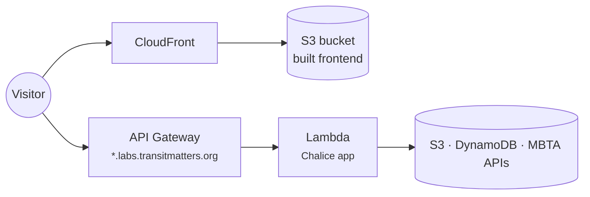

# Hosting & deploys

We're a nonprofit on a small budget, so we pick the cheapest option that works. Almost everything runs in one AWS account (`us-east-1`) or on GitHub Pages.

## The standard app

Most full-stack projects (Data Dashboard, New Train Tracker, Shutdown Tracker, Pride Bus, Station Explorer) look like this:

- **Frontend:** a static build, uploaded to an S3 bucket named after the site's domain and served through CloudFront.
- **Backend:** a Python [Chalice](https://aws.github.io/chalice/) app. Chalice looks like Flask, but each route becomes a Lambda function behind API Gateway.
- **Infrastructure:** defined in CloudFormation, so a deploy recreates the same setup every time.

## Ways we host things

| Option | When we use it | Used by |
|---|---|---|
| **Lambda + Chalice** | APIs and scheduled jobs. Costs nothing when idle, scales on its own, and `chalice local` runs it on your laptop. | Dashboard API, New Train Tracker, Shutdown Tracker, Pride Bus, Station Explorer, walkscore-proxy, data-ingestion, mbta-performance |
| **Plain Lambda** | A single long job that doesn't need Chalice. | slow-zones |
| **S3 + CloudFront** | Any static frontend. | Every app above |
| **EC2** | Something that must stay running, like a stream listener or a Node server. Costs more, so we avoid it. | gobble, Regional Rail Explorer, Futures Explorer |
| **GitHub Pages** | Fully static sites with no backend. | COVID Recovery Dashboard, these docs, [data-ingestion docs](https://transitmatters.github.io/data-ingestion/) |
| **GitHub Actions cron** | Tiny scripts that don't need AWS. | Slow Zone Bot |

!!! note "Chalice limits"
    Chalice schedules can't run more than once a minute, and it doesn't expose every Lambda setting. A few functions have memory or storage settings changed by hand in AWS. Check before you assume the config file is the whole story.

## How deploys work

1. Open a PR. GitHub Actions runs lint and tests.
2. A maintainer reviews and merges.
3. **Merging to `main` deploys to production**, usually within minutes. The `deploy.yml` workflow runs `deploy.sh`, which packages the app, updates CloudFormation, uploads the frontend and clears the CloudFront cache.

Several apps also redeploy automatically once a month. Some have a beta stack (`*-beta.labs.transitmatters.org`) that you can deploy by hand.

!!! tip "You don't need AWS access to contribute"
    Deploys run in CI with shared secrets. To run things locally, see [Getting started](../getting-started.md).
