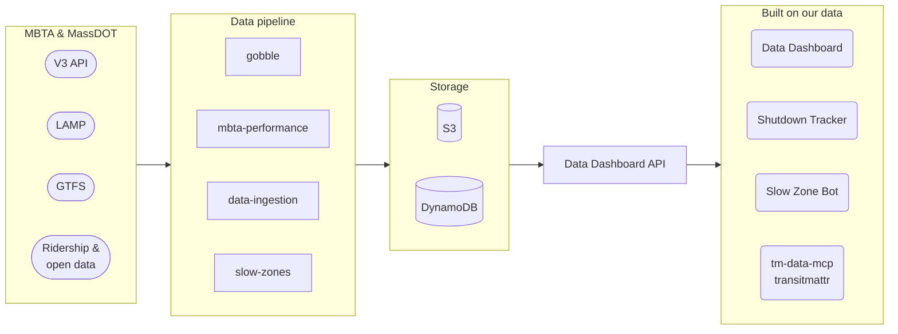
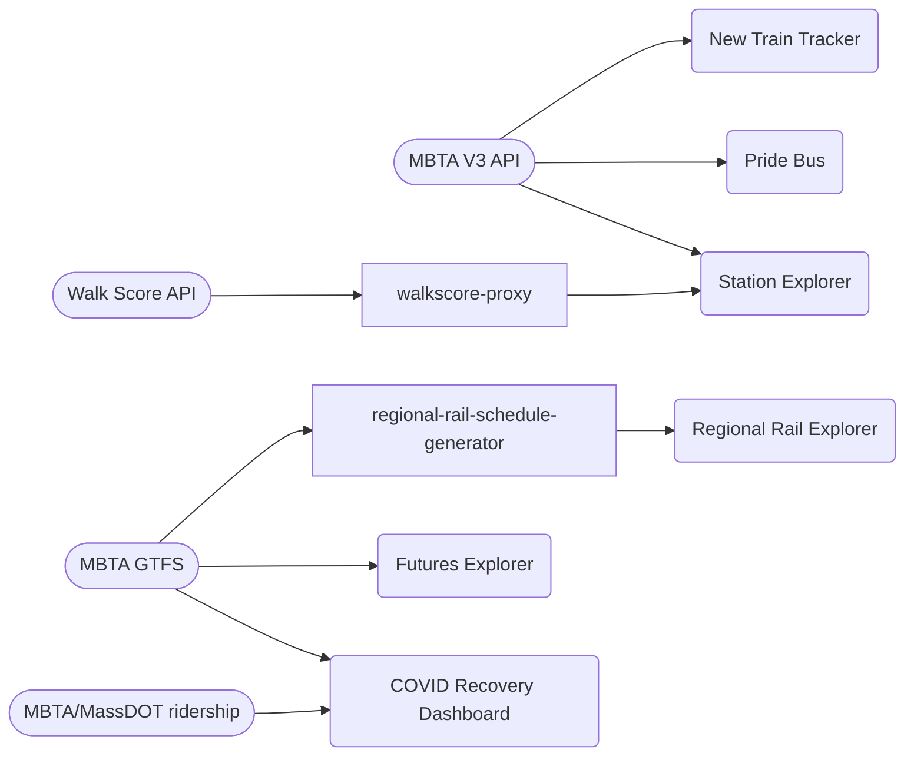

# Architecture overview

TransitMatters Labs is a set of small, independent projects. Most of them share a single data pipeline: **we copy MBTA data into our own AWS storage, crunch it on a schedule, and serve it through the Data Dashboard API.**

## The big picture

!!! info "One loop to know about"
    Some jobs (delivered trips, alert delays, slow zones) read the **API** rather than raw data, compute a summary, and write it back to storage. See [Data pipeline](data-pipeline.md#2-summaries).

## Standalone apps

These don't depend on the pipeline. They talk to MBTA data directly or ship their own.

## Reading the diagrams

| Shape | Means |
|---|---|
| `([ Stadium ])` | External data source |
| `[ Rectangle ]` | Code we run (jobs, APIs) |
| `[( Cylinder )]` | Storage |
| `( Rounded )` | Something people use: a site, bot or tool |

## Go deeper

- [Data sources](data-sources.md): where the raw data comes from
- [Data pipeline](data-pipeline.md): every bucket and table, and who writes and reads them
- [IDs & stations](ids.md): line, stop and direction conventions, and where station lists live
- [Hosting & deploys](hosting.md): how code gets from GitHub to production
- [Tech stack](stack.md): languages, frameworks and monitoring
