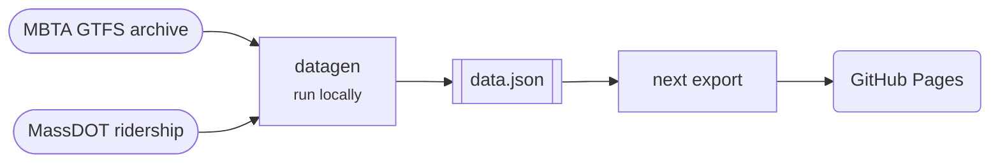

# COVID Recovery Dashboard

Tracks MBTA service levels and ridership since the start of the pandemic.

[Open the dashboard](https://recovery.transitmatters.org){ .md-button .md-button--primary } [Repo](https://github.com/transitmatters/mbta-covid-recovery-dash){ .md-button }

| | |
|---|---|
| **Stack** | Next.js (static export) · Python data scripts |
| **Runs on** | GitHub Pages (from `docs/` on `main`) |
| **Deploys** | Run `make update` locally and commit. No CI. |

## Good to know

- Maintenance mode: data is refreshed by hand every few months.
- See the README for the data sources and the update steps.
