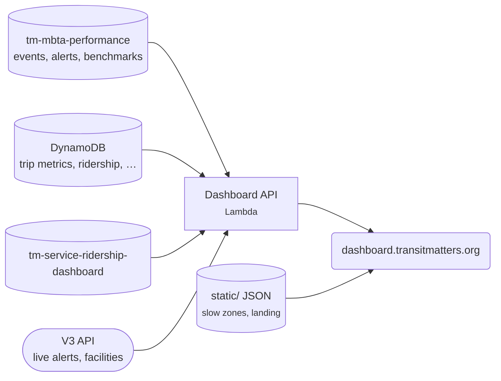

# Data Dashboard

Charts of MBTA performance (travel times, headways, dwells, slow zones), plus ridership and service levels for subway, bus, Commuter Rail and ferry. Our most-used project and the home of the API everything else reads.

[Open the dashboard](https://dashboard.transitmatters.org){ .md-button .md-button--primary } [Repo](https://github.com/transitmatters/t-performance-dash){ .md-button }

| | |
|---|---|
| **Stack** | Next.js (static export) · Python Chalice API |
| **Runs on** | S3 + CloudFront, Lambda at `dashboard-api.labs.transitmatters.org` |
| **Deploys** | Push to `main` |

The API only **reads**. Everything it serves is written by the [data pipeline](../architecture/data-pipeline.md).

## Good to know

- **No AWS access needed.** Set `TM_BACKEND_SOURCE=prod` to point your local frontend at the production API. See the [README](https://github.com/transitmatters/t-performance-dash#backend-data-source).
- **Other apps depend on this API:** Shutdown Tracker, slow-zones, data-ingestion, tm-data-mcp and transitmattr. Treat changes to existing endpoints with care.
- The OpenAPI spec is generated into `server/openapi.json`.
- Uses [stripmap](libraries.md#stripmap) for the slow zone map.
