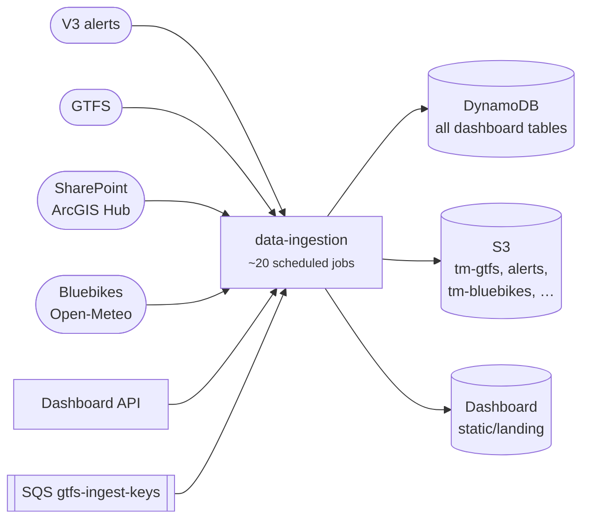

# data-ingestion

Our "cron farm": about 20 scheduled Lambda jobs that pull MBTA and third-party data, then fill most of our DynamoDB tables and several S3 buckets.

[API reference](https://transitmatters.github.io/data-ingestion/){ .md-button .md-button--primary } [Repo](https://github.com/transitmatters/data-ingestion){ .md-button }

| | |
|---|---|
| **Stack** | Python Chalice (scheduled functions) |
| **Runs on** | Lambda (CloudFormation stack `ingestor`) |
| **Deploys** | Push to `main` |

## Good to know

- **Every job and its schedule is in [`ingestor/app.py`](https://github.com/transitmatters/data-ingestion/blob/main/ingestor/app.py).** Start there.
- **Adding a job:** add a module in `ingestor/chalicelib/`, a schedule in `app.py`, and IAM permissions in `.chalice/policy*.json`. The [README](https://github.com/transitmatters/data-ingestion#readme) lists the steps.
- Some jobs read the Dashboard API, so a broken API can break ingestion too.
- `mbta-performance` requests missing GTFS feeds through the `gtfs-ingest-keys` SQS queue.
