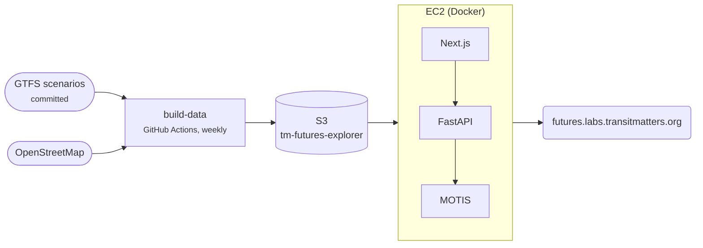

# Futures Explorer

A trip planner and travel-time map comparing today's network with proposed future networks.

[Open the explorer](https://futures.labs.transitmatters.org){ .md-button .md-button--primary }

!!! note "Private repo"
    Ask in Slack for access.

| | |
|---|---|
| **Stack** | Next.js + MapLibre · Python FastAPI · [MOTIS](https://github.com/motis-project/motis) routing · Docker |
| **Runs on** | One EC2 instance behind CloudFront |
| **Deploys** | Push to `main` builds images; a weekly data build triggers a redeploy |

## Good to know

- This is the only app that doesn't use Chalice. It's the most self-contained.
- Its README has a full architecture diagram and task reference.
