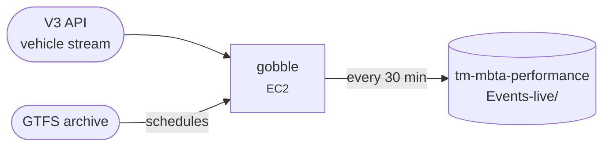

# gobble

Listens to the MBTA V3 streaming API around the clock and records bus, Commuter Rail and ferry arrivals and departures as event CSVs.

[Repo](https://github.com/transitmatters/gobble){ .md-button }

| | |
|---|---|
| **Stack** | Python (long-running process) |
| **Runs on** | One EC2 instance (`systemd` service) |
| **Deploys** | Push to `main` (CloudFormation + Ansible) |

## Good to know

- **Production records bus, Commuter Rail and ferry**, set in `.github/workflows/deploy.yml`. Subway comes from LAMP via [mbta-performance](mbta-performance.md). Your local `config/local.json` enables everything by default.
- **Merge between 9 PM and 6 AM.** Deploying restarts the live listener, so maintainers avoid doing it during service.
- This is one of the few things on EC2, because it needs a constant connection.

## gobble-wrta

[gobble-wrta](https://github.com/transitmatters/gobble-wrta) adapts gobble for Worcester's WRTA buses. It polls WRTA's vehicle API and publishes dashboard-style event CSVs plus an unofficial GTFS-Realtime feed. It runs in Docker on a small DigitalOcean server, not AWS, and isn't wired into the dashboard yet.
