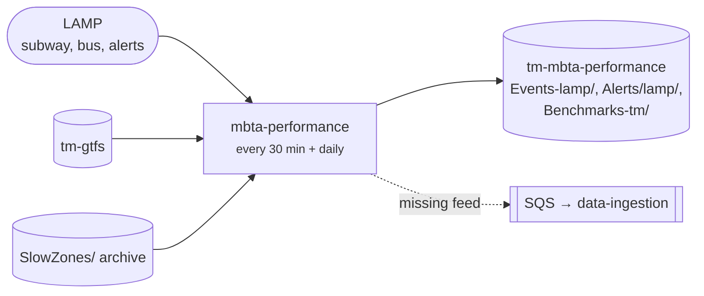

# mbta-performance

Turns the MBTA's [LAMP](../architecture/data-sources.md#lamp) files into the per-stop event CSVs the dashboard reads. Also builds travel-time benchmarks and alert files.

[Repo](https://github.com/transitmatters/mbta-performance){ .md-button }

| | |
|---|---|
| **Stack** | Python Chalice · pandas + pyarrow |
| **Runs on** | Lambda (stack `mbta-performance`) |
| **Deploys** | Push to `main` |

## Good to know

- Today's subway data is processed every 30 minutes. Yesterday's subway and bus data is reprocessed once a day.
- Historical monthly files are loaded by hand. Follow the [historic runbook](https://github.com/transitmatters/mbta-performance/blob/main/mbta-performance/chalicelib/historic/README.md).

## lamp

[transitmatters/lamp](https://github.com/transitmatters/lamp) is our fork of [mbta/lamp](https://github.com/mbta/lamp), the MBTA's own pipeline. **We don't run it.** We use the fork to send improvements upstream so the public LAMP data has what we need.

!!! warning "Naming trap"
    Inside LAMP, `tm` means **TransitMaster** (the MBTA's bus system), not TransitMatters.
