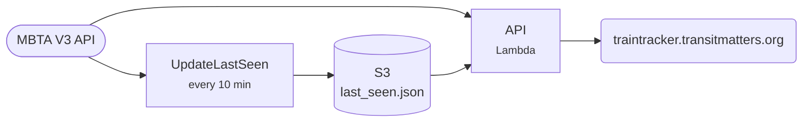

# New Train Tracker

A live map of the MBTA's new Orange, Red and Green Line cars, plus when each was last seen.

[Open the tracker](https://traintracker.transitmatters.org){ .md-button .md-button--primary } [Repo](https://github.com/transitmatters/new-train-tracker){ .md-button }

| | |
|---|---|
| **Stack** | Vite + React · Python Chalice API |
| **Runs on** | S3 + CloudFront, Lambda at `traintracker-api.labs.transitmatters.org` |
| **Deploys** | Push to `main` |

## Good to know

- You need a free [MBTA V3 API key](https://api-v3.mbta.com/) to run it locally.
- It used to run on EC2. It's serverless now, so ignore old notes about SSH keys.
- The `Containerfile` is for running locally. It isn't deployed.
