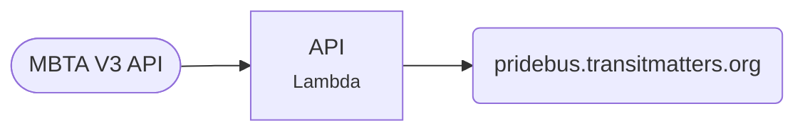

# Pride Bus

A live map tracking the MBTA's Pride-wrapped bus.

[Open the tracker](https://pridebus.transitmatters.org){ .md-button .md-button--primary } [Repo](https://github.com/transitmatters/pride-bus){ .md-button }

| | |
|---|---|
| **Stack** | Vite + React + Leaflet · Python Chalice API |
| **Runs on** | S3 + CloudFront, Lambda at `pride-bus-api.labs.transitmatters.org` |
| **Deploys** | Push to `main` |

## Good to know

- Seasonal: it gets most attention around June. When the bus changes, update its vehicle ID.
- A good first project. It's small and follows our [standard app](../architecture/hosting.md#the-standard-app) pattern exactly.
