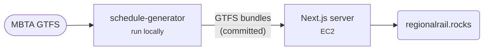

# Regional Rail Explorer

A trip planner that compares today's Commuter Rail with a proposed, electrified Regional Rail network.

[Open the explorer](https://regionalrail.rocks){ .md-button .md-button--primary } [Repo](https://github.com/transitmatters/regional-rail-explorer){ .md-button }

| | |
|---|---|
| **Stack** | Next.js (with server-side routing logic) |
| **Runs on** | One EC2 instance behind CloudFront |
| **Deploys** | Push to `main` (CloudFormation + Ansible) |

## Good to know

- No database or external API. All routing runs in memory, using GTFS bundles committed to `data/`.
- [expansion-explorer](https://github.com/transitmatters/expansion-explorer) is a fork that adds subway expansion scenarios. It is currently dormant.

## Schedule generator

[regional-rail-schedule-generator](https://github.com/transitmatters/regional-rail-schedule-generator) builds the imagined Regional Rail and expansion GTFS. Run it locally with `make build date=YYYY-MM-DD`, then copy the output into this repo's `data/`. Its [docs/README.md](https://github.com/transitmatters/regional-rail-schedule-generator/blob/main/docs/README.md) covers adding stations and updating bundles.
