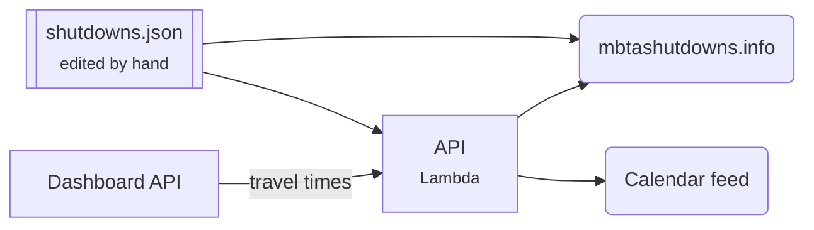

# Shutdown Tracker

Lists planned MBTA subway shutdowns and shows travel times before and after each one. Also offers a calendar feed.

[Open the tracker](https://mbtashutdowns.info){ .md-button .md-button--primary } [Repo](https://github.com/transitmatters/shutdown-tracker){ .md-button }

| | |
|---|---|
| **Stack** | Vite + React · Python Chalice API |
| **Runs on** | S3 + CloudFront, Lambda at `shutdowns.labs.transitmatters.org` |
| **Deploys** | Push to `main` |

## Good to know

- **Adding a shutdown means editing `src/constants/shutdowns.json`.** No database involved.
- Travel times come from the [Data Dashboard](data-dashboard.md) API. The backend just proxies them.
