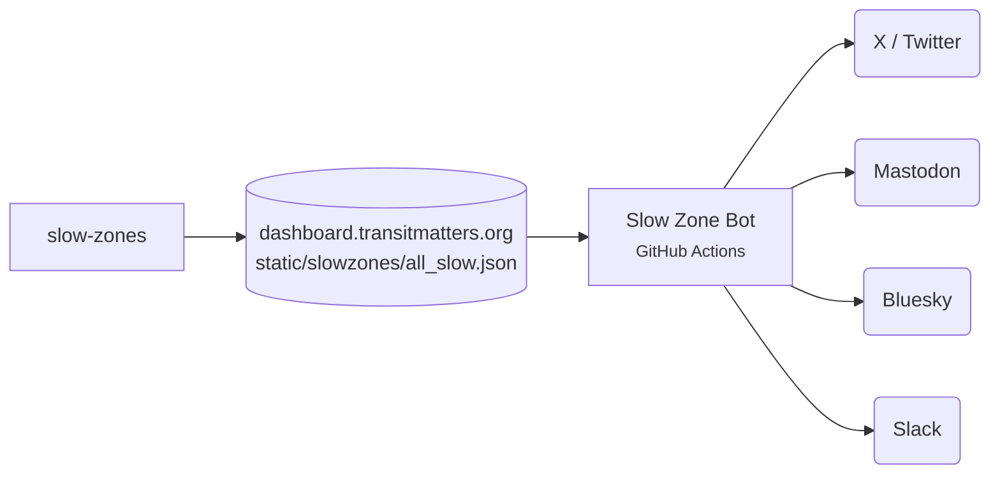

# Slow Zone Bot

Posts new and fixed MBTA slow zones every morning, with links back to the dashboard.

[Repo](https://github.com/transitmatters/mbta-slow-zone-bot){ .md-button } [@mbtaslowzonebot on Mastodon](https://better.boston/@mbtaslowzonebot){ .md-button }

| | |
|---|---|
| **Stack** | A single Python script |
| **Runs on** | GitHub Actions, daily at 13:05 UTC |
| **Deploys** | Nothing to deploy: the workflow runs whatever is on `main` |

## Good to know

- Every PR runs the bot with `--dry-run`, so you can see what it would post.
- If `all_slow.json` wasn't updated today, the bot fails on purpose. Check [slow-zones](slow-zones.md) first.
