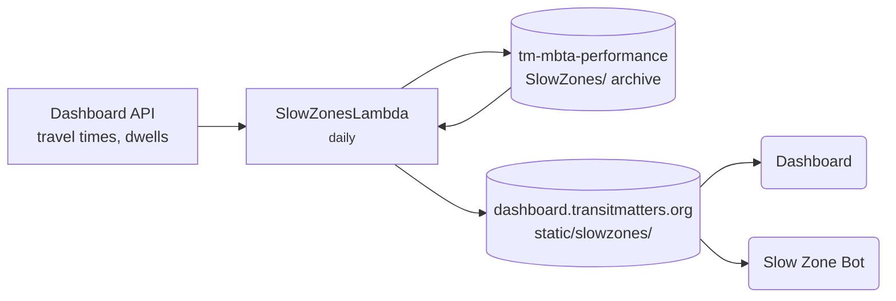

# slow-zones

Finds stretches of track where trains are consistently slower than normal, then publishes them for the dashboard's Slow Zones page and the [Slow Zone Bot](slow-zone-bot.md).

!!! note "Private repo"
    Ask in Slack for access.

| | |
|---|---|
| **Stack** | Python + pandas (plain Lambda, not Chalice) |
| **Runs on** | Lambda `SlowZonesLambda`, daily at 10:00 UTC |
| **Deploys** | Push to `main` |

## Good to know

- The output files are `all_slow.json` and `delay_totals.json`.
- The archive also feeds [mbta-performance](mbta-performance.md)'s travel-time benchmarks.
