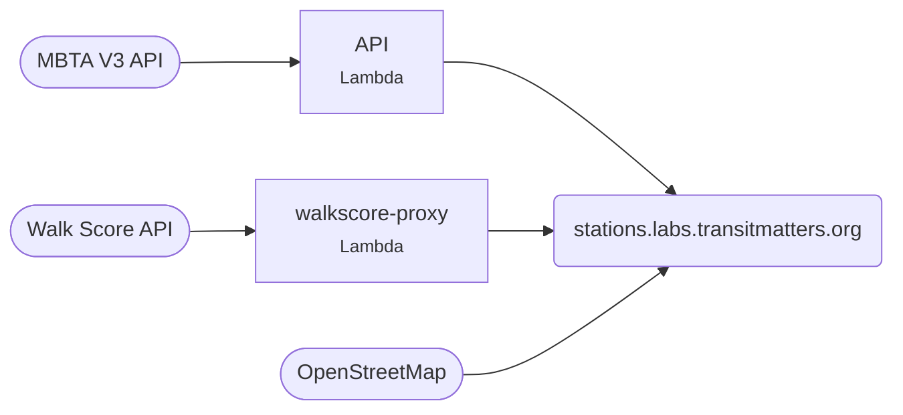

# Station Explorer

Everything about an MBTA station: facilities, elevators and escalators, routes, alerts and walkability.

[Open the explorer](https://stations.labs.transitmatters.org){ .md-button .md-button--primary }

!!! note "Private repo"
    Ask in Slack for access.

| | |
|---|---|
| **Stack** | Vite + React · Python Chalice API |
| **Runs on** | S3 + CloudFront, Lambda at `stations-api.labs.transitmatters.org` |
| **Deploys** | Push to `main` |

## walkscore-proxy

A tiny Chalice API, [walkscore-proxy](https://github.com/transitmatters/walkscore-proxy), that returns walk and bike scores for an MBTA stop ID. It keeps our Walk Score API key out of the browser. Only Station Explorer is allowed to call it. It deploys by hand with `deploy/deploy.sh`.
